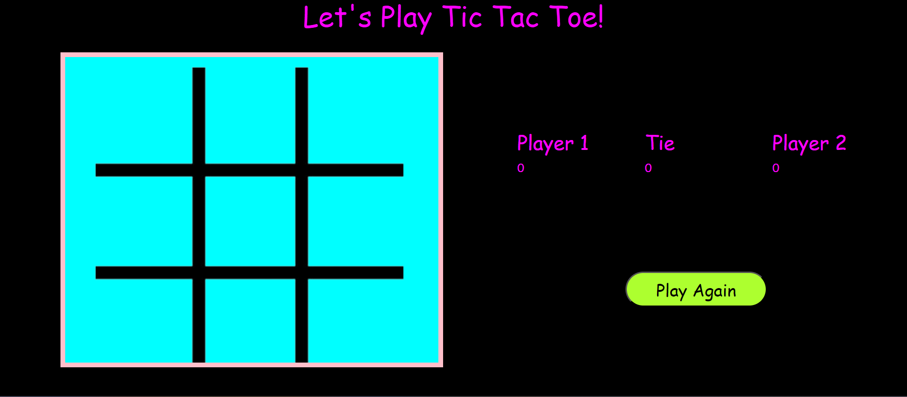

# Tic-Tac-Toe

An engaging implementation of the classic Rock, Paper, Scissors game, designed to be played directly in the terminal using Java. This project features a user-friendly command-line interface and presents a simple yet enjoyable gaming experience, offering two distinct modes of play: a one-player mode, where you can challenge the computer's randomized choices, and a two-player mode, perfect for playing with a friend. 

## Introduction 

### Rules 

  * Two players take turns clicking on a square to place 'X' and 'O' marks in empty spaces on a 3x3 game board.

  * Player1 starts first with the 'X' mark.

  * After each turn, players are shown a message displaying whose turn it is next, unless there is a winner or a tie.

  * Players cannot change the mark in a square that has already been selected or click the same square twice in one game. 
  
  * The first player to place 3 consecutive 'X' or 'O' marks in a horizontal, vertical, or diagonal row wins the game.

  * If there is still no winner by the time all squares on the board have been filled, the game ends in a tie.

  * Players will not be able to continue playing after a player wins or tie has been declared.

  * Players can start a new tic tac toe game if they wish to play again.

  * Players can keep score throughout multiple rounds and view the number of tied games and wins for each player.

  ## Author

  :technologist: Erica Ayala 

  * [LinkedIn](https://www.linkedin.com/in/ayalavirtual)

  * [GitHub](https://www.github.com/AyalaVirtual) 

